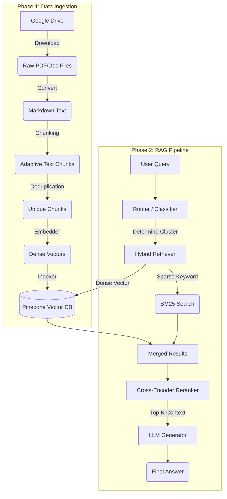

# 🛡️ Food Safety RAG System: Complete Documentation

Welcome to the **Food Safety Retrieval-Augmented Generation (RAG)** pipeline. This document provides a highly detailed, comprehensive overview of the entire project, including the core architecture, data ingestion workflow, real-time RAG pipeline, and the purpose of every major component.

---

## 🏗️ System Architecture Overview

The system is designed to take unstructured regulatory food safety documents (PDFs, DOCX files) and confidently answer domain-specific questions in Arabic. It is composed of two primary workflows:
1. **The Ingestion Pipeline (`run_pipeline.py`)**: Transforming files into embedded chunks and indexing them in a vector database.
2. **The RAG Pipeline (`main.py` / `app/main.py`)**: Taking a user query, retrieving the most relevant chunks, and generating an LLM-backed answer based purely on that context.



---

## 📥 1. Data Ingestion Pipeline (The 6 Stages)

The ingestion process is controlled by `run_pipeline.py`, which is an orchestrator spanning six stages. This pipeline allows for streaming embeddings directly to Pinecone to ensure low RAM overhead.

### Stage 0: Download (`scripts/download_drive.py`)
- **How it works:** Authenticates with Google Drive using PyDrive2 (via `credentials.json` and `token.json`). It reads a manifest (`data/raw/drive_files.json` for Egypt/Saudi configs), locates Google Drive folders, and recursively downloads PDFs or DOCX files into a local `data/raw/{cluster}/` folder.
- **Resumability:** Skip logic bypasses files that have already been fully downloaded to speed up subsequent runs.
- **Identity:** Emits a `metadata.json` for each cluster associating the cluster ID and type.

### Stage 1: Conversion (`scripts/text_extraction.py`)
- **How it works:** Walks through the local `data/raw/` directory and converts every supported document into Markdown. The output goes to `data/markdown/{cluster}/{stem}.md`.
- **Fault-Tolerance:** Uses an append-safe JSON manifest (`conversion_manifest.json`) after *every single file*. If the program crashes, it simply resumes from the exact file where it failed.

### Stage 2: Chunking (`scripts/chunking.py`)
- **How it works:** Executes an adaptive chunking algorithm taking `CHUNK_MIN_SIZE`, `CHUNK_MAX_SIZE`, and `CHUNK_OVERLAP` bounds. 
- **Metadata Enrichment:** Affixes deep context to every chunk, such as the cluster identifier, file type, original file name, source title, and highly stable SHA-256 chunk IDs that do not change upon re-runs. 

### Stage 3: Deduplication (`pipeline/deduplication.py`)
- **How it works:** It uses TF-IDF vectorization with **character n-grams (size 3-5)**. This is a very powerful, *language-agnostic* technique that works flawlessly on Arabic text without strict linguistic tokenization.
- **Cosine Similarity:** Computes pairwise cosine similarity matrices. If a given chunk overlaps by >90% (the default `DEDUP_THRESHOLD`) with a previous chunk, it is flagged.
- **Reporting:** Dropped chunks, along with their similarity percentages, are recorded in `data/dedup_report.json` to safely audit why chunks were ignored.

### Stage 4: Embedding (`pipeline/embedder.py`)
- **How it works:** Leverages the `sentence-transformers` library (specifically `BAAI/bge-m3`) to convert the deduplicated Arabic text into 1024/768-dimensional dense vectors.
- **Hardware & Caching:** Automatically utilizes GPU batching. Extracted embeddings are cached as numpy (`.npy`) files in `data/embeddings/` using their unique `chunk_id`.

### Stage 5: Indexing (`pipeline/indexer.py`)
- **How it works:** Takes the generated vectors (+ raw text payload mapped as metadata fields) and pushes them to **Pinecone**.
- **Execution:** Pushes in batches of 100 vectors per API call (the Pinecone maximum optimization size), partitioning data via Pinecone *namespaces* corresponding to the cluster names (e.g. "Chocolate" / "الشيكولاتة").

---

## 🧠 2. Retrieval-Augmented Generation (RAG) Process

Triggered via `main.py` or the web interface (`app/main.py`), this phase aims to take an end-user query and construct a heavily grounded response.

### Step 1: Intelligent Router (`core/router.py`)
Rather than blindly searching the entire database, the router calls an LLM (using `services/llm_service.py`) and passes the user’s query along with all valid cluster names. 
- **Fuzzy Normalization:** Since queries might have misspellings in Arabic (e.g. أ vs ا vs إ), a normalizer resolves the LLMs output cleanly back to standard namespace strings to enforce perfect Pinecone queries.

### Step 2: Hybrid Retrieval (`core/hybrid_retriever.py`)
- **Semantic Path (Dense):** Generates an embedding of the user’s question and performs a cosine-similarity hunt against Pinecone across the narrowed namespaces (found in Step 1). 
- **Keyword Path (Sparse):** Parallelly executes `retrievers/bm25_retriever.py`, a classic search system that ensures exact keyword matches aren't missed. 
- **Union:** Both subsets are deduplicated based on literal text payload string matching and joined.

### Step 3: Cross-Encoder Reranker (`core/reranker.py`)
Simply embedding questions yields recall noise. The reranker (`cross-encoder/ms-marco-MiniLM-L-6-v2`) evaluates the literal "semantic pair" relation of `[Query, Retrieved Text]`, predicting a highly accurate relevancy score. It re-scores the retrieved context arrays and filters only the absolute top-K.

### Step 4: Generation (`core/generator.py`)
- **Execution:** Puts together a synthesized prompt wrapping the user’s query and the Top-K reranked chunk texts.
- **Safeguard:** The prompt actively mandates that if the answer isn't in the provided text, the LLM must admit ignorance instead of risking hallucinations.
- **Completion:** Triggers the LLM service (Gemini / Groq) via API connection, answering the user!

---

## 📂 3. Directory Layout Deep-Dive

* **`app/`**: Contains the FastAPI web backend (`main.py`) paired with pristine CSS/Vanilla-JS frontend files deployed in a `/static/` folder. This runs the premium Web GUI.
* **`config/`**: Holds `settings.py` acting as central repository for environmental variables, loading mappings for distinct deployment paths (such as `egypt` vs. `saudi`).
* **`core/`**: Heart of the runtime pipeline (`generator.py`, `pipeline.py`, `retriever.py`, `router.py`, `reranker.py`).
* **`data/`**: The state of raw documents to output vectors.
  * `/raw/{country}/{cluster}`: Pre-convert PDFs.
  * `/markdown/{country}/{cluster}`: Converted representation.
  * `/embeddings/{country}/`: Serialized `.npy` vectors.
* **`pipeline/`**: Dedicated sub-processes for the offline embedding side (`deduplication.py`, `embedder.py`, `indexer.py`). 
* **`scripts/`**: Orchestration logic spanning external downloading, document converting, and chunk splitting. 
* **`services/`**: Isolated API managers for interactions with Google Gemini (`gemini_service.py`), Groq LLM interfaces (`groq_service.py`), and Pinecone (`pinecone_service.py`).
* **`run_pipeline.py`**: The ingestion master script.
* **`main.py`**: The terminal prompt Q&A execution interface.
* **`run_web_app.py`**: Uvicorn launcher to quickly bootstrap the web portal.

---

## 💻 4. Running The Implementation

**Environment Prerequisites (`.env`)**:
You require API keys to operate the pipeline locally:
```env
PINECONE_API_KEY=your_key
PINECONE_INDEX_NAME=food-safety
GEMINI_API_KEY=your_gemini_key
GROQ_API_KEY=your_groq_key
EMBEDDING_MODEL=BAAI/bge-m3
```

**Running Ingestion (Updating Knowledge Base)**:
```bash
python run_pipeline.py --country saudi   # Embeds all clusters in the Saudi Dataset
python run_pipeline.py --country egypt --cluster haccp  # Targets only a specific cluster
python run_pipeline.py --stage chunk dedup embed index # Skips download & conversion
```

**Using the Chatbot**:
```bash
# Option 1: Terminal Mode
python main.py --query "ما هي شروط تخزين الشيكولاتة لضمان سلامتها؟"

# Option 2: Full Web Interface App
python run_web_app.py
# (Navigate to localhost:8000)
```
