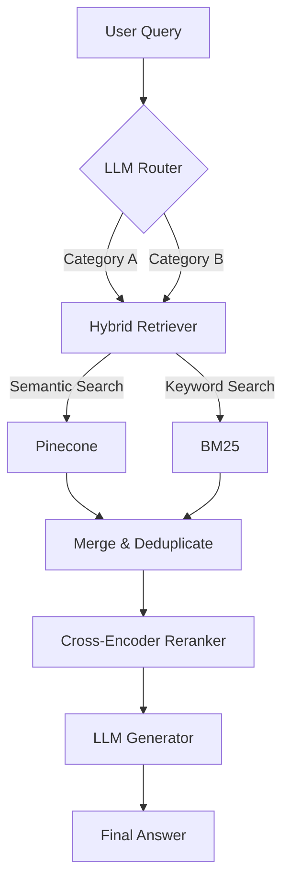

# 🛡️ Food Safety RAG Pipeline

[](https://www.python.org/downloads/)
[](https://opensource.org/licenses/MIT)
[](https://deepmind.google/technologies/gemini/)
[](https://groq.com/)

An enterprise-grade **Retrieval-Augmented Generation (RAG)** system specifically engineered for food safety compliance and domain knowledge. This pipeline transforms unstructured regulatory documents into a high-precision interactive knowledge base.

---

## ✨ Key Features

- **🚀 Multi-Stage Pipeline**: Modular architecture featuring Routing, Hybrid Retrieval, Reranking, and Generation.
- **🧠 Intelligent Routing**: LLM-based query classification to target specific document categories (e.g., FDA, EFSA, USDA).
- **🔍 Hybrid Search Engine**: Combines **Semantic Vector Search** (Pinecone + Gemini Embeddings) with **BM25 Keyword Search** for maximum recall.
- **🎯 Precision Reranking**: Utilizes a **Cross-Encoder reranker** to ensure the most relevant context is prioritized for the LLM.
- **⚡ High-Speed Inference**: Powered by **Groq** for near-instantaneous response generation.
- **📁 Automated Data Sync**: Integrated Google Drive sync for seamless knowledge ingestion.

---

## 🏗️ Architecture Overview

The pipeline follows a sophisticated 4-step process to ensure accuracy and relevance:

1.  **Routing**: The query is analyzed by an LLM to identify relevant categories.
2.  **Hybrid Retrieval**: Parallel execution of semantic and keyword search across targeted categories.
3.  **Reranking**: A secondary scoring pass using a Cross-Encoder to filter out noise.
4.  **Generation**: Final response synthesized using Gemini/Groq with retrieved context.



---

## 📂 Project Structure

```text
├── config/             # Configuration & Environment Management
├── core/               # Main RAG Logic (Router, Retriever, Reranker, Pipeline)
├── data/               # Raw & Processed Data
├── rerankers/          # Custom Reranking Implementations
├── retrievers/         # Specialized Search Modules (BM25, etc.)
├── scripts/            # Utility Scripts (Drive Sync, Ingestion)
├── services/           # External API Integrations (Gemini, Groq, Pinecone)
├── utils/              # Logging & Helper Utilities
└── main.py             # System Entry Point
```

---

## 🛠️ Setup & Installation

### 1. Clone & Install
```bash
git clone https://github.com/your-repo/Food_Safety_RAG.git
cd Food_Safety_RAG
python -m venv venv
source venv/bin/activate  # On Windows: venv\Scripts\activate
pip install -r requirements.txt
```

### 2. Environment Variables
Create a `.env` file in the root directory:
```env
# Vector Database
PINECONE_API_KEY=your_pinecone_key
PINECONE_ENVIRONMENT=your_env
PINECONE_INDEX_NAME=food-safety

# AI Services
GEMINI_API_KEY=your_gemini_key
GROQ_API_KEY=your_groq_key
```

### 3. Google Drive Sync
1. Place `credentials.json` (OAuth 2.0) in the root.
2. Run the sync script:
   ```bash
   python scripts/download_drive.py
   ```

---

## 🚀 Usage

Execute the main pipeline to start querying your food safety knowledge base:

```bash
python main.py --query "What are the latest FDA regulations on heavy metals in baby food?"
```

---

## 🛠️ Technologies

- **LLM**: [Google Gemini](https://ai.google.dev/) / [Groq](https://groq.com/)
- **Vector DB**: [Pinecone](https://www.pinecone.io/)
- **Embeddings**: `text-embedding-004` (Gemini)
- **Reranker**: `cross-encoder/ms-marco-MiniLM-L-6-v2`
- **Framework**: Python 3.9+

---

## 📄 License
This project is licensed under the MIT License - see the [LICENSE](LICENSE) file for details.
