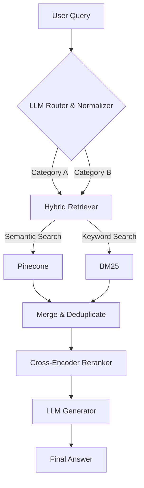

# 🛡️ Food Safety RAG Pipeline

[](https://www.python.org/downloads/)
[](https://opensource.org/licenses/MIT)
[](https://deepmind.google/technologies/gemini/)
[](https://groq.com/)

An enterprise-grade **Retrieval-Augmented Generation (RAG)** system specifically engineered for food safety compliance and domain knowledge. This pipeline transforms unstructured regulatory documents into a high-precision interactive knowledge base with a premium web interface.

---

## ✨ Key Features

- **🌐 Premium Web Portal**: Modern, high-end web interface with Glassmorphism design and real-time chat.
- **🚀 Multi-Stage Pipeline**: Modular architecture featuring Routing, Hybrid Retrieval, Reranking, and Generation.
- **🧠 Intelligent Bilingual Routing**: LLM-based query classification with built-in **Arabic Normalization** and fuzzy matching.
- **🔍 Hybrid Search Engine**: Combines **Semantic Vector Search** (Pinecone + BGE-M3/Gemini) with **BM25 Keyword Search** for maximum recall.
- **🎯 Precision Reranking**: Utilizes a **Cross-Encoder reranker** to ensure the most relevant context is prioritized for the LLM.
- **⚡ High-Speed Inference**: Powered by **Groq** and **Gemini 3 Flash** for near-instantaneous response generation.
- **📁 Automated Data Sync**: Integrated Google Drive sync for seamless knowledge ingestion.

---

## 🏗️ Architecture Overview

The pipeline follows a sophisticated 4-step process to ensure accuracy and relevance:

1.  **Routing**: The query is analyzed by an LLM to identify relevant categories. Includes Arabic normalization for consistent mapping.
2.  **Hybrid Retrieval**: Parallel execution of semantic and keyword search across targeted namespaces (clusters).
3.  **Reranking**: A secondary scoring pass using a Cross-Encoder to filter out noise and prioritize relevance.
4.  **Generation**: Final response synthesized using Gemini/Groq with retrieved context.



---

## 📂 Project Structure

```text
├── app/                # Web Portal (FastAPI + Vanilla JS/CSS)
│   ├── static/         # Premium Frontend assets
│   └── main.py         # API Backend
├── config/             # Configuration, Environment & Cluster Mapping
├── core/               # Main RAG Logic (Router, Retriever, Reranker, Pipeline)
├── data/               # Raw, Processed & Markdown Data
├── pipeline/           # Ingestion Stages (Deduplication, Embedding, Indexing)
├── scripts/            # Utility Scripts (Drive Sync, Text Extraction, Chunking)
├── services/           # External API Integrations (Gemini, Groq, Pinecone)
├── utils/              # Logging, Chunking & Normalization Utilities
├── main.py             # CLI Entry Point
└── run_web_app.py      # Web Portal Launcher
```

---

## 🛠️ Setup & Installation

### 1. Clone & Install
```bash
git clone https://github.com/your-repo/Food_Safety_RAG.git
cd Food_Safety_RAG
python -m venv venv
source venv/bin/activate  # On Windows: venv\Scripts\activate
pip install -r requirements.txt
pip install fastapi uvicorn  # For the web portal
```

### 2. Environment Variables
Create a `.env` file in the root directory:
```env
# Vector Database
PINECONE_API_KEY=your_pinecone_key
PINECONE_INDEX_NAME=food-safety

# AI Services
GEMINI_API_KEY=your_gemini_key
GROQ_API_KEY=your_groq_key

# Model Settings
EMBEDDING_MODEL=BAAI/bge-m3
EMBEDDING_DIMENSION=1024
```

---

## 🚀 Usage

### Option 1: Web Portal (Recommended)
Launch the premium web interface for an interactive experience:
```bash
python run_web_app.py
```
Then open **http://localhost:8000** in your browser.

### Option 2: CLI Interface
Execute the main pipeline directly from the terminal:
```bash
python main.py --query "ما هي شروط تخزين الشيكولاتة لضمان سلامتها؟"
```

---

## 🛠️ Technologies

- **Backend**: [FastAPI](https://fastapi.tiangolo.com/)
- **LLM**: [Google Gemini](https://ai.google.dev/) / [Groq](https://groq.com/)
- **Vector DB**: [Pinecone](https://www.pinecone.io/)
- **Embeddings**: `BAAI/bge-m3` / `text-embedding-004`
- **Reranker**: `cross-encoder/ms-marco-MiniLM-L-6-v2`
- **Framework**: Python 3.9+

---

## 📄 License
This project is licensed under the MIT License - see the [LICENSE](LICENSE) file for details.
